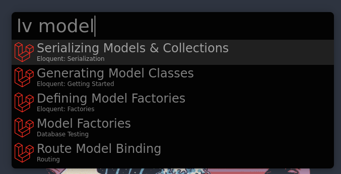

# Laravel Docs Extension for Albert

[Albert](https://github.com/albertlauncher/albert) extension for quickly and easily searching the Laravel documentation.





## Requirements

You will need the `algoliasearch` [Python API Client](https://www.algolia.com/doc/api-client/getting-started/install/python/) installed on your system.

## Installation

Simply clone this project into your extension directory by running the following command:

```
git clone https://github.com/use-the-fork/albert-laravel-docs.git ~/.local/share/albert/python/plugins/albert-laravel-docs
```

## Usage

Type `lv` followed by your search query.

```
lv <query>
lv unit testing
```


[](https://www.buymeacoffee.com/usethefork)